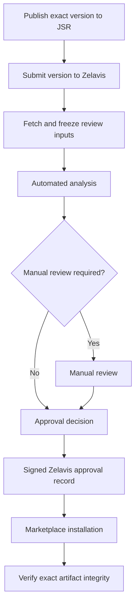
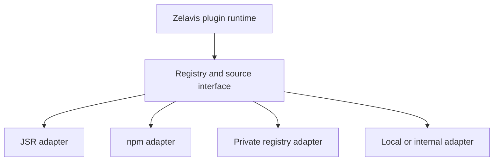

# Zelavis JSR Plugin Review and Approval Architecture

## Purpose of this document

This document proposes an architecture for distributing, reviewing, approving, installing, and updating third-party Zelavis plugins.

The central idea is:

> Require every plugin version submitted to the official Zelavis Marketplace to be published as an immutable JSR package first. Zelavis then reviews and approves the exact version and artifact, rather than trusting the plugin name as a whole.

This gives Zelavis a stable package artifact for every review and prevents a developer from silently replacing the code of a version that has already been approved.

This document should be treated as a design and research brief. Before implementation, verify all relevant JSR APIs, metadata formats, integrity guarantees, download behavior, yanking behavior, rate limits, and terms against the current official JSR documentation.

---

## 1. Why JSR fits the Zelavis plugin model

JSR package versions are immutable. Once a version such as:

```text
@vendor/plugin@1.2.0
```

has been published, the publisher cannot replace that version with different source code. If the developer needs to fix or change the plugin, a new version must be published:

```text
@vendor/plugin@1.2.0  ← original immutable version
@vendor/plugin@1.2.1  ← new fixed version
```

That property is particularly valuable for a reviewed marketplace. If Zelavis reviews `1.2.0`, the reviewed source cannot later be silently changed while retaining the same version number.

JSR also aligns naturally with the proposed Zelavis plugin architecture:

- A plugin is a normal JavaScript or TypeScript ESM package.
- It uses the official Zelavis JavaScript/TypeScript SDK.
- It declares its Zelavis-specific metadata and capabilities.
- It does not depend on a proprietary archive format merely to participate in the marketplace.
- The package can remain useful within the wider JavaScript ecosystem.

The important security principle is:

> Publication is permanent, but publication is not approval.

JSR provides the immutable package artifact. Zelavis provides review, policy, trust, permissions, installation control, and revocation.

---

## 2. The central trust model

Zelavis must distinguish between the following concepts.

### Published

The package version exists on JSR. This proves only that an artifact was published. It does not mean Zelavis has reviewed or endorsed it.

### Verified publisher

Zelavis has verified the identity or control of the package publisher or organization. This establishes accountability, but it does not make every version safe.

### Approved version

The exact package version and artifact have passed the required Zelavis review policy.

### Installed version

A specific Zelavis instance has installed the approved artifact and recorded its exact identity and integrity information.

These states must never be collapsed into a single `verified` or `trusted` flag. A verified publisher can still publish a vulnerable or malicious update. An approved plugin can release an unapproved new version.

The Marketplace UI could express this distinction clearly:

```text
@acme/analytics
Publisher: Verified ✓
Version 3.4.1: Zelavis Reviewed ✓
Version 3.5.0: Awaiting Review
```

---

## 3. Approval belongs to an exact version and artifact

Approval must never apply automatically to an entire package name.

For example:

```text
@vendor/plugin@1.0.0  → approved
@vendor/plugin@1.0.1  → not reviewed; blocked by default
@vendor/plugin@1.1.0  → not reviewed; blocked by default
@vendor/plugin@2.0.0  → not reviewed; blocked by default
```

Publishing an update does not inherit approval from the previous release. Every new version becomes a separate review object.

The approval identity should include at least:

```ts
interface ApprovedPluginRelease {
  registry: "jsr";
  packageName: string;
  version: string;

  // Integrity of the exact artifact Zelavis reviewed and permits.
  integrity: string;

  status:
    | "submitted"
    | "automated_review"
    | "manual_review"
    | "approved"
    | "rejected"
    | "suspended"
    | "revoked";

  publisherId: string;
  submittedAt: string;
  reviewedAt?: string;
  approvedAt?: string;
  reviewerId?: string;

  manifestDigest: string;
  dependencySnapshotDigest: string;
  requestedPermissions: PluginPermission[];
  grantedPermissions: PluginPermission[];

  policyVersion: string;
  findings: ReviewFinding[];
}
```

The real schema can differ, but the implementation must preserve the distinction between package identity, version identity, artifact integrity, declared permissions, granted permissions, dependency state, and review status.

---

## 4. Do not trust only `package + version`

JSR's immutability is a major foundation, but Zelavis should still store and verify the cryptographic integrity of the exact reviewed artifact.

Conceptually, an approved release should be pinned by:

```text
registry + package name + version + artifact integrity
```

During installation, Zelavis must:

1. Resolve the precise approved version; never use a floating range such as `^1.2.0`.
2. Download the package through the approved registry adapter.
3. Calculate or verify its integrity value using the chosen canonical artifact representation.
4. Compare the value with the Zelavis approval record.
5. Reject installation if the values do not match.
6. Store the verified value in the local installation record and lockfile.

This protects Zelavis against implementation errors, unexpected upstream behavior, cache corruption, proxy problems, or ambiguity over which generated artifact was reviewed.

The agent must research what JSR exposes as authoritative integrity metadata and decide whether Zelavis should hash:

- the canonical JSR source artifact;
- JSR's package manifest and all files in canonical order;
- an npm-compatibility tarball;
- a Zelavis-generated canonical bundle; or
- more than one of these representations.

The reviewed representation and installed representation must be defined precisely. Zelavis must not review one set of bytes and later execute a materially different generated representation without independently binding and validating it.

---

## 5. Proposed official Marketplace workflow



### Submission

The developer submits an exact JSR package reference, not a version range:

```text
jsr:@vendor/plugin@1.3.0
```

The submission should include any required Marketplace metadata, requested permissions, documentation, privacy information, support information, licensing, and publisher verification data.

### Freeze the review inputs

At submission time, Zelavis should capture all inputs needed to reproduce the review:

- exact package name and version;
- artifact integrity;
- source files or canonical package snapshot;
- package manifest;
- Zelavis plugin manifest;
- complete dependency graph and resolved versions;
- declared and inferred permissions;
- build or transformation configuration;
- review-policy version;
- scanner and analyzer versions.

This allows an approval decision to be audited and, as far as possible, reproduced later.

### Automated analysis

The first review stage should include at least:

- package metadata validation;
- supported Zelavis API and SDK compatibility checks;
- ESM import and initialization validation;
- manifest/schema validation;
- dependency and vulnerability scanning;
- license-policy checks;
- secrets and credential scanning;
- obfuscation and generated-code detection;
- suspicious API and behavior detection;
- network, filesystem, subprocess, dynamic-code, native-module, and environment access analysis;
- requested-permission versus observed-behavior comparison;
- malware analysis;
- install and uninstall lifecycle testing;
- resource-usage and denial-of-service checks;
- deterministic or reproducible-build checks where applicable;
- isolated runtime smoke tests.

Automated analysis must produce findings and evidence. It should not merely return a single pass/fail boolean.

### Manual review

Manual review can be selected based on risk rather than being required equally for every update. Factors can include:

- a new publisher;
- a first Marketplace submission;
- new or expanded permissions;
- sensitive permissions;
- large code or dependency changes;
- obfuscated or generated code;
- unusual network destinations;
- native code or subprocess access;
- security scanner findings;
- changes to authentication, payments, user data, or administration behavior;
- prior policy violations;
- a random audit sample.

Even if Zelavis later introduces expedited review for trusted publishers or low-risk patches, the new version must still receive its own explicit approval record.

### Approval publication

After approval, the Zelavis approval service should publish a signed record binding the approved status to the exact registry, package, version, integrity, permissions, dependency snapshot, and policy version.

Zelavis instances should verify this signed record before treating the package as Marketplace-approved. This prevents an untrusted Marketplace mirror or compromised transport path from inventing approvals.

---

## 6. Manifest and permission design

The package should declare that it is a Zelavis plugin through the agreed package metadata, for example:

```json
{
  "name": "@vendor/analytics",
  "version": "1.3.0",
  "type": "module",
  "exports": {
    ".": "./src/index.ts"
  },
  "zelavis": {
    "kind": "plugin",
    "apiVersion": "1",
    "permissions": [
      "database:read",
      "storage:read",
      "network:https://api.example.com"
    ]
  }
}
```

This is illustrative. The implementation agent should align it with the current Zelavis package and plugin architecture.

Permissions should be:

- explicit and machine-readable;
- narrow enough to communicate real risk;
- validated during review;
- enforced at runtime rather than serving only as documentation;
- shown clearly to administrators before installation and updates;
- compared between releases;
- denied by default when absent;
- versioned so the permission model can evolve.

There are three permission sets worth recording separately:

1. **Requested permissions** — what the plugin asks to use.
2. **Approved permissions** — what the Marketplace review authorizes for that exact release.
3. **Locally granted permissions** — what a particular Zelavis administrator permits on that installation.

Effective access should be the intersection of the approved and locally granted permissions. A local administrator must not be able to accidentally grant Marketplace trust for behavior that the reviewed version was never approved to perform.

---

## 7. Dependency handling is part of the trust decision

A plugin's direct source is only one part of its executable supply chain. Dependencies can introduce code that was not obvious from reviewing the plugin itself.

The approval system must define whether it approves:

- only direct plugin files;
- the complete resolved transitive dependency graph;
- a bundled artifact containing all executable dependencies; or
- a hybrid model.

For a strong initial model, resolve and record the full dependency graph during review, pin all versions, and ensure installation executes the same dependency snapshot. Do not allow dependency ranges to resolve differently on the user's server after approval.

An approval record should therefore include a dependency snapshot digest or equivalent lock data. If the dependency graph changes, the reviewed artifact identity must change or the installation must fail.

The agent should investigate how JSR resolves npm and JSR dependencies, how lockfiles are represented across supported runtimes, and how Zelavis can make installation reproducible across Node.js, Deno, and Bun where those runtimes are supported.

---

## 8. Installation behavior

The official Marketplace installation path should follow a strict sequence:

1. User selects an exact approved plugin version.
2. Zelavis retrieves the signed approval record.
3. Zelavis verifies the record's signature and validity.
4. Zelavis checks compatibility with the running Zelavis and SDK/API version.
5. Zelavis displays permissions and relevant security or privacy notices.
6. The exact artifact and dependency snapshot are downloaded.
7. Integrity is verified before any plugin code or install hook executes.
8. Static policy checks required locally are performed.
9. Installation or migrations run in the appropriate isolation and transaction model.
10. The plugin is activated only after successful verification and installation.
11. Zelavis records the package reference, version, integrity, approval-record identity, permissions, and installation time.

No unverified `postinstall`, setup script, migration, or import should execute before integrity and approval checks complete.

If installation fails, Zelavis should leave the instance in the previous known-good state wherever technically possible.

---

## 9. Update behavior

Updates must never be silently treated as trusted merely because an earlier version was approved.

For example:

```text
Installed:  @vendor/plugin@1.2.0  approved
Available:  @vendor/plugin@1.2.1  awaiting review
Result:     do not offer normal trusted update yet
```

Once `1.2.1` is approved, Zelavis can offer it as an update. Before confirmation, show meaningful differences:

- old and new versions;
- approval status;
- permission additions or removals;
- publisher changes;
- important security findings or notices;
- compatibility and migration requirements;
- whether rollback is supported.

Automatic updates, if Zelavis supports them, must select only exact versions carrying a valid approval under the administrator's configured update policy. A semantic version range is a selection preference, not a substitute for per-version approval and integrity verification.

Permission expansion should normally require new administrator consent even when automatic updates are enabled.

---

## 10. Yanking, suspension, and revocation

JSR yanking and Zelavis approval revocation solve different problems.

### JSR yanking

A publisher may yank a problematic version so normal dependency resolution avoids it. However, a yanked version may remain obtainable by an exact version reference or from an existing lockfile. Zelavis must not assume that yanking erases the artifact.

### Zelavis suspension or revocation

Zelavis needs its own status and response system:

- **Suspended** — temporarily prevent new installations while investigating.
- **Revoked** — approval has been withdrawn because of a confirmed security, policy, legal, or integrity problem.
- **Rejected** — the submitted release never received approval.

The platform must separately decide what happens to already-installed versions. Possible actions include:

- warn administrators;
- block new installations;
- block reactivation after disablement;
- disable automatic updates from or to the affected version;
- recommend or require an upgrade;
- remotely disable only under a narrowly defined critical-security policy;
- allow temporary continued use with an explicit administrator override in self-hosted deployments.

This policy needs careful design because remote disabling has major trust, availability, and self-hosting implications. The agent should propose severity levels and an explicit emergency-response policy rather than embedding an undocumented kill switch.

Approval records and revocations should be append-only or fully auditable. Do not delete the historical fact that a release was once approved.

---

## 11. Marketplace policy versus runtime capability

JSR should be required by the **official Zelavis Marketplace policy**, not hard-coded as the only source the core plugin runtime can ever understand.

Recommended separation:



The expected defaults should be:

| Context | Default policy |
| --- | --- |
| Official Zelavis Marketplace | Exact JSR version required; Zelavis approval required |
| Official Zelavis Cloud | Approved Marketplace versions by default; explicit internal policy for exceptions |
| Normal self-hosted installation | Approved Marketplace versions by default; administrator may enable alternative sources |
| Enterprise installation | May use a private registry and private approval authority |
| Local plugin development | Local workspace or development source allowed with a prominent unreviewed/development status |

This preserves the security and simplicity of a JSR-backed official Marketplace without unnecessarily locking the entire Zelavis architecture to one public service.

The core should expose a source-adapter contract conceptually similar to:

```ts
interface PluginSourceAdapter {
  readonly kind: string;

  resolve(reference: PluginReference): Promise<ResolvedPluginRelease>;
  fetch(release: ResolvedPluginRelease): Promise<FetchedPluginArtifact>;
  verify(
    artifact: FetchedPluginArtifact,
    expected: ExpectedIntegrity,
  ): Promise<VerificationResult>;
}
```

Approval authorities should also be separable from source registries. A company might fetch packages from its private registry and approve them using its own internal signing authority.

---

## 12. Developer mode and sideloading

Zelavis will likely need local plugin development and possibly sideloading. These paths must not be confused with Marketplace approval.

Development plugins should be clearly marked throughout the UI:

```text
UNREVIEWED DEVELOPMENT PLUGIN
Source: local workspace
Marketplace approval: none
```

Recommended rules:

- development mode must be explicitly enabled;
- local plugins must not receive permissions implicitly;
- production instances should disable development sources by default;
- sideloaded plugins should remain visibly unreviewed;
- an administrator installing an alternative-source plugin should see its source, permissions, and integrity details;
- a locally installed package must never display the Zelavis Reviewed badge merely because it uses the same package name and version as an approved release;
- the exact artifact hash must match the approval record before any approval badge is inherited.

This makes the platform open and useful to developers without weakening the meaning of Marketplace review.

---

## 13. Review scalability

Per-version approval can create operational load. The architecture should therefore support risk-based review without weakening artifact-level trust.

Possible optimizations include:

- automated approval for narrowly defined low-risk changes that pass every policy check;
- priority queues for verified publishers;
- differential review showing code, manifest, permission, and dependency changes since the last approved release;
- cached analysis for unchanged dependencies;
- reproducible build evidence;
- publisher security history and risk scoring;
- mandatory manual review for sensitive permission classes;
- random audits of automatically approved releases;
- transparent review status and expected queue times.

The shortcut must never be `publisher is trusted, therefore all future versions are trusted`. The safe shortcut is `this exact new artifact passed a reduced, policy-defined review path and received its own signed approval record`.

---

## 14. Availability and registry failure

Requiring JSR for official submissions introduces a service dependency. The agent should plan for:

- temporary JSR outages;
- slow or rate-limited downloads;
- removed or restricted accounts;
- package yanking;
- regional or network availability problems;
- future registry policy changes;
- long-term preservation of approved artifacts.

Zelavis should strongly consider maintaining a content-addressed cache or archive of every approved artifact and its review inputs, subject to licensing and JSR policy. This cache must preserve the exact bytes and integrity metadata; it must not create a mutable copy under the same logical identity.

The installer can prefer or fall back between JSR and an authorized Zelavis artifact cache while verifying the same approved integrity value. Approval must remain bound to content, not to the URL that happened to serve it.

Research the legal, licensing, attribution, and retention implications before operating such a cache.

---

## 15. Security boundaries and limitations

This design materially improves supply-chain safety, but immutable packages and review do not make arbitrary plugin code safe by themselves.

Zelavis still needs runtime security controls such as:

- process or workload isolation appropriate to the deployment backend;
- enforceable capabilities and permissions;
- network egress restrictions;
- secret scoping;
- filesystem restrictions;
- database access boundaries;
- resource limits and timeouts;
- auditable plugin actions;
- safe migration handling;
- incident response and revocation distribution.

Static analysis can miss malicious behavior. Manual review can miss vulnerabilities. A benign plugin can later be exploited. A dependency can contain a latent flaw. Marketplace review should therefore be one layer in a defense-in-depth model, not the runtime sandbox.

The runtime and isolation architecture should remain backend-agnostic. The same plugin permission and approval model should work whether Zelavis runs plugins natively during development or uses containers, Firecracker-based isolation, or another production backend.

---

## 16. Recommended initial product policy

For the first official implementation, use the following opinionated defaults:

1. Official Marketplace submissions must reference an exact public JSR package version.
2. Every version receives an independent Zelavis review and approval record.
3. Approval binds package name, version, canonical artifact integrity, dependency snapshot, permissions, and review-policy version.
4. Official Marketplace installation verifies a signed approval record and artifact integrity before executing any plugin code.
5. New versions are blocked from the trusted update path until approved.
6. Permission expansion requires explicit review and normally new administrator consent.
7. JSR publisher verification and Zelavis publisher verification are treated as related but distinct signals.
8. Yanked versions are not automatically erased or assumed safe; Zelavis tracks its own suspension and revocation status.
9. The core runtime uses source adapters and is not permanently coupled to JSR.
10. Self-hosters can enable private, local, npm, or other sources, but those installations are clearly distinguished from official Marketplace-reviewed artifacts unless an applicable approval authority has signed the exact artifact.
11. Zelavis retains auditable review inputs and, if policy permits, content-addressed copies of approved artifacts.
12. Runtime isolation and permission enforcement remain mandatory even for reviewed plugins.

---

## 17. Questions the implementation agent must answer

Before coding the production system, research and document answers to the following.

### JSR artifact identity

- What exact artifact and integrity metadata does JSR expose?
- Is the JSR source artifact the representation Zelavis will execute?
- How do JSR's npm-compatible generated artifacts and internal revisions work?
- Can generated npm-compatible artifacts differ without changing the original JSR source version?
- Which bytes must Zelavis review and which bytes must it verify at installation?

### Resolution and dependencies

- How are JSR and npm dependencies resolved across Node.js, Deno, and Bun?
- Can Zelavis create a runtime-independent canonical dependency snapshot?
- Should approved plugins be bundled after review?
- How are optional, platform-specific, or native dependencies handled?

### Publishing and identity

- Which JSR publisher or scope identity signals are available through APIs?
- How will Zelavis prove that a Marketplace publisher controls the submitted JSR package?
- How are ownership transfers and compromised publisher accounts handled?

### Review and signing

- What service owns approval records?
- What signing format and key-rotation strategy should be used?
- How do offline or air-gapped instances receive approval and revocation data?
- How are review policies and scanner versions recorded?

### Runtime enforcement

- Which requested permissions can Zelavis actually enforce for every supported backend?
- Which permissions require stronger isolation than a native in-process plugin permits?
- Can a plugin be imported safely enough to inspect it without executing top-level code?
- How will install hooks, migrations, scheduled tasks, and background processes be constrained?

### Marketplace operations

- Which changes qualify for automated review?
- What requires manual review?
- What is the emergency revocation policy?
- What evidence and explanations are shown to publishers when a version is rejected?
- What review history is visible to administrators and end users?

### Availability and preservation

- May Zelavis legally and technically mirror approved JSR artifacts?
- How long should artifacts and review evidence be retained?
- How does installation work during a JSR outage?
- How are compromised caches detected and repaired?

---

## 18. Suggested implementation phases

### Phase 1: Architecture and proof of concept

- Define canonical plugin references.
- Implement the source-adapter interface with JSR as the first adapter.
- Fetch an exact JSR version.
- Define and calculate canonical integrity.
- Validate Zelavis plugin metadata.
- Create a local approval-record prototype.
- Prove exact-artifact installation and rejection on mismatch.

### Phase 2: Marketplace review pipeline

- Add version submission.
- Freeze review inputs and dependency snapshots.
- Add automated analyzers and isolated smoke tests.
- Add reviewer workflow and findings.
- Generate signed approval records.
- Display distinct publisher and version trust states.

### Phase 3: Secure installation and updates

- Verify signatures, integrity, compatibility, and permissions.
- Add transactional installation and rollback behavior.
- Add per-version update approval.
- Add permission-diff consent.
- Add local installation lock records and audit history.

### Phase 4: Revocation and enterprise sources

- Add suspension, revocation, and security notices.
- Add signed revocation distribution.
- Add private-registry and local-development adapters.
- Support private enterprise approval authorities.
- Add approved-artifact preservation and outage behavior.

---

## 19. Final architectural decision

The recommended design is:

> Use JSR as the required immutable publication layer for the official Zelavis Marketplace. Review and approve every exact plugin version separately, bind approval to cryptographic artifact integrity and a fixed dependency snapshot, and verify that identity before installation. Keep the underlying Zelavis plugin runtime registry-agnostic so development, self-hosting, private registries, and enterprise approval systems remain possible without weakening the meaning of official Marketplace approval.

This achieves the main goal: an already-reviewed plugin release cannot silently turn into different code under the same version number. At the same time, it avoids making Zelavis technically dependent on JSR as its only possible plugin source forever.

The durable rule should be:

> Package names identify projects. Versions identify releases. Integrity identifies code. Zelavis approval trusts only the exact combination.

---

## Official JSR references for the agent

- JSR immutability: <https://jsr.io/docs/immutability>
- JSR packages and yanking: <https://jsr.io/docs/packages>
- Publishing packages: <https://jsr.io/docs/publishing-packages>
- npm compatibility: <https://jsr.io/docs/npm-compatibility>

The implementation agent should re-check these pages and any linked API or registry specifications before treating the proposed data structures as final.
